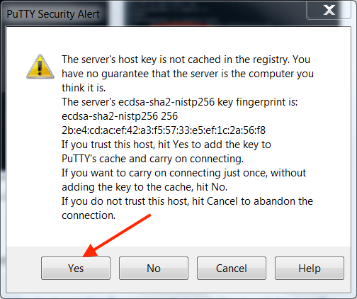
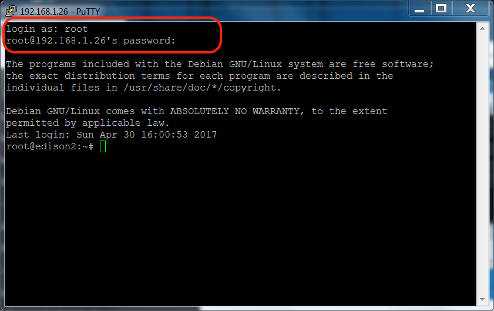
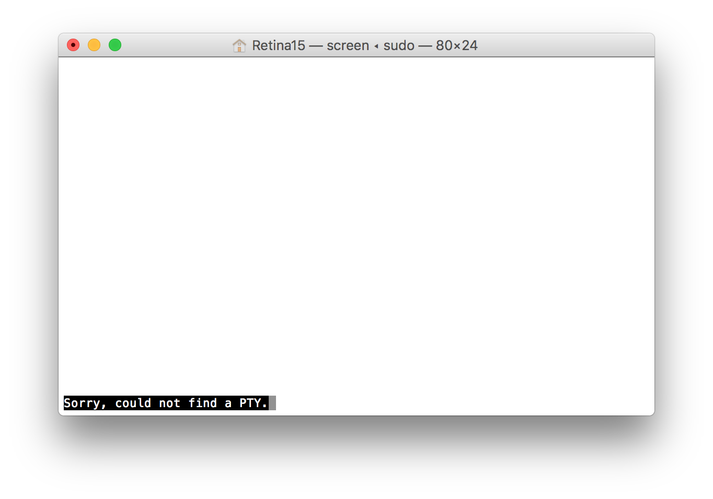
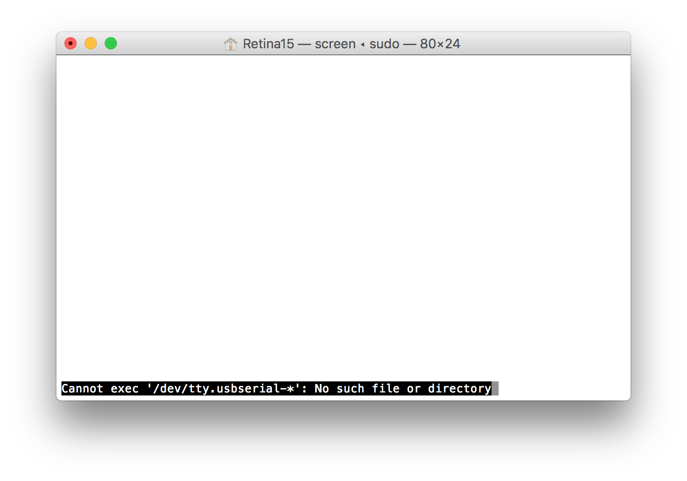
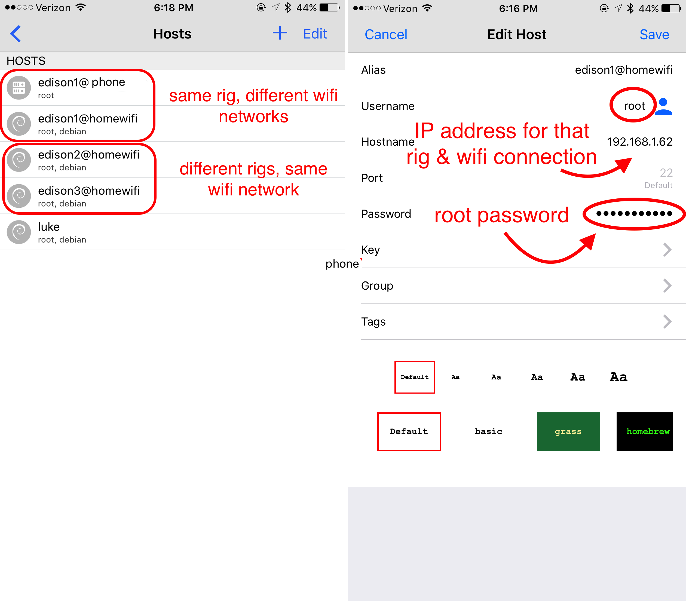

# How to access your OpenAPS rig 

You will need to access your OpenAPS rig’s software when you want to:

* Update your loop software (oref0 update, especially when new features are available)
* Change your preferences.json (update max-iob, turn on/off advances features)
* Change your pump (update pump serial number for different pump)
* Change your Dexcom system (G4 to G5)
* Change your Nightscout URL that you use
* Get a new iPhone and need to re-pair bluetooth with rig
* Add/change known wifi networks and network passwords
* Run reports or check logs

Since the rig is basically a computer without a screen or keyboard, there are various options to get you access you’ll need.  The option available will depend mostly on the wifi network your gear is connected to.

If you are using a Mac computer, access will be using the Terminal App which comes with the computer.  It can be found in the Utilities folder within Applications.

If you are using a Windows computer, access will be using PuTTY program.  You likely already downloaded it when you setup your OpenAPS rig.  If you are at a new computer and need to [install Edison drivers](https://software.intel.com/en-us/iot/hardware/edison/downloads) and [PuTTY](http://www.chiark.greenend.org.uk/~sgtatham/putty/download.html).  If you need details about installing them, go back to the [Windows guide Step 1-1](http://openaps.readthedocs.io/en/latest/docs/walkthrough/phase-0/windows-edison.html#)

## If your computer and rig are on the same wifi network


### For Mac computers

* Open the Terminal App found in the Utilities folder in Applications.

* Use the command `ssh root@edisonhost.local` (**or whatever you named your edison host**, in the example below, the hostname was edison1).  If this is your first time logging in to the rig on the computer, you may get a message about the authenticity of the host and whether you want to add the key fingerprint to the list of known hosts.  Go ahead and answer yes.  You will be asked for the password for the rig...enter your root password that you setup in Phase 0 (the default was edison).  Realize that keystrokes will not appear as you enter the password.  A successful login will result in a screen similar to below.


* If you get an error about "could not resolve hostname", it is likely that your rig is actually connected to a different wifi network than the computer. Try the screen method (directions below) for connecting to your rig.


* If you get an scary looking error about "WARNING: REMOTE HOST IDENTIFICATION HAS CHANGED!" that is likely because you are attempting to login to a rig that has the same hostname as a previous rig that has been logged into on the computer.  (This is why you want to use unique hostnames if you are going to have multiple rigs.)  You can delete the history of known hosts for the rig by entering the commands `cd .ssh` and then `rm known_hosts`.  This will delete the log of known hosts on your computer.  There's no significant downside to removing the known_host log, except that you will need to answer yes to the key fingerprint additions again for the first time you login to old rigs again.  After you delete the known hosts, you can use the `ssh root@edisonhost.local` command to login, as described above.


### For Windows computers

* Open PuTTY program

* Click the SSH radio button and then enter the IP address of the rig on the "Host Name" line in PuTTY.  If you do not know the IP address of the rig, you can obtain it by logging on using Serial connection (described below) and using the command `ifconfig`.


Alternatively, you can log in to your wifi router and find your rig's IP address.


* Click the Open button and, if this is your first time logging into the rig using PuTTY using ssh, you may see a warning regarding the server's host key.  Click yes to add the host key to PuTTY's cache. 



* Login using login name `root` and password is whatever you changed it to during setup in Phase 0.  The default password was edison.  As you type the password, no keystrokes will appear on the screen.  Successful login will leave you at a prompt for the root user.



## If your computer and rig are on different wifi networks


**Access to the rig will need a cable to connect the UART port on the rig with the USB port on the computer.  You will need a cable capable of transmitting data.  If you try all of the steps below and are unsuccessful at connecting, try a new cable.**

### For Mac computers

* Use the Terminal app on the Mac, or follow [these directions for Windows](http://openaps.readthedocs.io/en/latest/docs/walkthrough/phase-0/setup-edison.html#if-you-re-using-a-windows-pc-for-console)

* If you're using a Mac, use the command `sudo screen /dev/tty.usbserial-* 115200` to enable “screen” mode.  You will be prompted to enter a password.  Enter your **computer's password** not the rig's password here.


* You may see a blank screen.  Press RETURN to bring up the edison’s login screen.  Login as `root` and use your root password (you should have changed it from the default of `edison` during the setup of the rig - if not, please [go back and do so now](http://openaps.readthedocs.io/en/latest/docs/walkthrough/phase-0/setup-edison.html#initial-edison-setup).  A successful login will look like below.


* If instead, you see a message at the bottom of the screen that says "Sorry, could not find a PTY." that usually means the system has not cleared a previous screen session.  If you only had the rig connected by one cable in the UART port on rig, you can simply unplug the rig from the computer and move to a new USB port on the computer.  If you don't have any "new" USB ports that were not used by the previous login attempt, then close out terminal app, restart the computer, and try again.  This will clear the error.



* If instead you see a message at the bottom of the screen that says "Cannot exec '/dev/tty.usbserial-*': No such file or directory", double check that you have your rig and computer connected via the rig's UART port.  Using the OTG port will cause this error message.  Or typos in the screen command will have same result.  Double check your spelling, or better yet...use copy and paste whenever possible.



### For Windows Users

* Navigate to your Control Panel and then to Device Manager.  Click on the Ports to open your USB serial port.  Find the COM port that the rig is connected to.  In the screenshot below, COM7.  Note: different USB ports will have different numbers.  If you regularly plug your rig into the computer and use this connection type, you may need to make sure you update the COM number in the steps below if you are switching between different USB ports.  


* Open PuTTY program.  Click on the Serial radio button, enter the COM number you got from the previous step into the Serial line number and change the speed to 115200.  Click on Open button.


* Enter `root` for the login and the password is whatever you changed it to during setup in Phase 0.  The default password was edison.  As you type the password, no keystrokes will appear on the screen.  Successful login will leave you at a prompt for the root user as shown below.


## If your iPhone and rig are on the same wifi network


One of the most convenient ways to do quick edits on your rig’s settings may be by using an app on your iPhone.  You will need to make sure your rig and your iPhone are sharing the same network (e.g., home wifi, mifi, or personal hotspot) and here are the instructions.  Each connection point will need it’s own “host” setup in the app.

* Download “Terminus SSH Shell/Console/Terminal” from iPhone app store

* Set up a new “host” in the app with the following information.  Remeber, you will need to setup a new "host" for every rig and every wifi connection that you will use to connect.  For example, I have three rigs that I regularly connect to on my home wifi network; edison1 (the rig my daughter regularly wears), edison2 (the rig we keep in her bedroom), and edison3 (the rig we keep in the living room).  Since my daughter's mobile rig (edison1) can sometimes need to be accessed while we are on the road, I also have a host setup for when her rig is connected to my phone's hotspot.

```
Alias:     enter a name that will remind you which rig and what network (such as rig name @ home wifi, iphone hotspot, or mifi device since each connection will have a unique IP address)
Username:     root
Hostname:     enter the IP address of the rig on that particular wifi network (see below if you need help finding the IP address)
Password:     enter your rig's root password 
```
* Clicking on the “host” in the app will launch an ssh connection with the rig and you can use the iPhone to access the rig’s software.  They must be on the same network as the “host” connection specifies though, or else the connection will fail.



## How to determine the IP address of your rig?

Private IP addresses are assigned for devices and are unique to the connection.  So, your rig’s IP address when using your iPhone’s hotspot will be different than your rig’s IP address when using your home wifi.  So, you’ll need to find the IP address for the particular connection you are using.

* If rig and iPhone connected to a mifi device, the mifi device may list connected devices and IP addresses.  Look for your edison rig on there.

* If iPhone and rig are connected via the iPhone’s personal hotspot, you can download an app such as iNet to scan the network for devices and find your edison rig.  The IP address will be listed with the scan information.


* If the rig is accessible by computer (by either method listed above, ssh or console) **AND** the iPhone and rig are on same network as each other, you have a couple options.  You can login on Terminal app and use `ifconfig` to read the wlan0 inet address


OR login to your router to see the list of connected devices and find your edison rig.  Google your router’s brand name and “router login” (e.g., Netgear router login) to find out how to access your router’s administrative area.

## Shortcut to see IP and wifi network name that your rig is on

**Tip**: for rigs updated ([here is how to update](http://openaps.readthedocs.io/en/latest/docs/walkthrough/phase-2/update-your-rig.html)) after 2/7/17, you can also now type `wifi` hit enter; it will bring up the last 100 lines of the network log so you can see your IP address AND the network name of the wifi that your rig is on.
