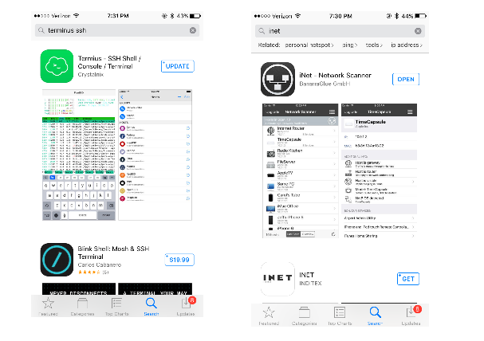
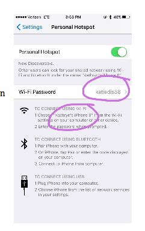
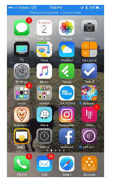
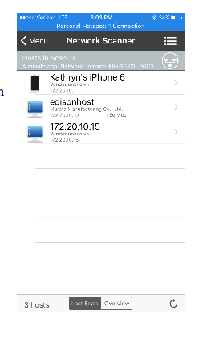
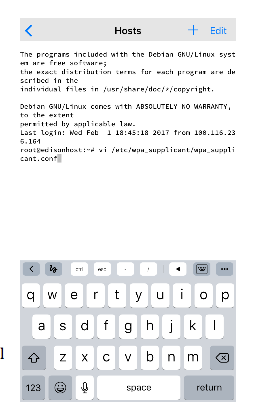

# How to add a new wifi network while out and about

Since OpenAPS rig needs internet connection, most of the times we would prefer to have the rig on a wifi connection.  Using our iPhones as hotspots can rack up data use and burn iPhone battery pretty quick.  So, let’s say your kid is going to a sleepover at a friend’s house and you’d like to put her rig on the friend’s wifi network.  Unless you bring your laptop with you…you might be stumped how to do that?  Here’s a walkthrough for how to get that done…the setup is a bit long at first, but you can use the resulting connection to do many other things with your rig on-the-go.

1. Get a couple iPhone apps to help us
2. Hotspot connect the iPhone and rig
3. Get an IP address for the rig
4. Set up a connection to the rig on the iPhone
5. Edit the list of wifi networks on the rig


## 1. Get a couple of iPhone apps

On the iPhone, download these two apps:

* Termius – SSH Shell/Console/Terminal 
* iNet



## 2. Hotspot connect iPhone and rig

You should have already added your iPhone’s hotspot info to the wifi network list previously.  If you have questions about how to do that, see the [Simple Mac setup guide](../phase-0/edison-explorer-board-Mac.md).  

But, as a hint, you can find your iPhone hotspot information under Settings, Personal Hotspot. Your network name and password are listed there.  Use the `vi /etc/wpa_supplicant/wpa_supplicant.conf` command while logged on the rig from a computer.



We’ve made sure your iPhone is in the rig’s network list (technically called a “wpa supplicant list”).  Now get in a place where your rig is not on another network.  In other words, if you are at home…turn off your wifi for a bit by unplugging your router.  Or get in your car and drive a few blocks away.  We need the rig to connect to your iPhone hotspot.  

You can tell your rig is connected to your iPhone when you see a blue bar above the screen.  It will tell you one “1 Connection”…and that is your rig!  Yes.


 
## 3. Get an IP address for the rig

* Open the iNet app

* Click on the big “NETWORK SCANNER” 


* Click on the three little bars in the upper right, and then choose “Scan Settings” from the drop down list that will appear.


* Edit the Start IP and End IP scan settings to  172.20.10.1 and 172.20.10.20  (devices connected to your iPhone hotspot will be in that range).

* Press the blue/black “Scan” button on the bottom right of the screen (it may be a little hidden because the display gets a little pushed down by the hotspot bar on the top of iPhone).


* The scan results should show a device labeled “edisonhost” (or whatever name you chose for the rig in the setup process.  If you don’t see it quickly, try rescanning.

* Copy down  or screenshot the IP address listed under the device. (in this example, 172.20.10.10) 



We are all done with the iNet app. 


## 4. Set up a connection to the rig on the iPhone

Now we are moving over to the Termius app.  When you first open the app, it will prompt you to add a new host.  Go ahead and click the button to add a new host.  You are going to fill out the following lines:
```
Alias – pick a name that let’s you know this is the rig when it’s hotspotted with your iPhone

Username – click to the left of the little blue man and type “root”

Hostname – Enter the IP address we just got from the iNet app

Password – Enter your rig’s root password (default is “edison” but you likely changed it during setup)
```

Click “Save” in the upper right corner.


Congrats…you should now see the host you just created.  If you click on that host, you’ll see a message that it is connecting and then…


## 5. Edit the list of wifi networks on the rig 

You’re IN!  Congrats!  

**Warning** The instructions below describe how to edit your rig's network settings, which determine whether your rig can connect to your hotspot.  Just in case you might mess up the config and "step on your own air hose", be sure you have a backup method of connecting to your rig (perhaps using Bluetooth, or your laptop and a USB console connection) or a backup rig available.  Be careful when editing wpa_supplicant.conf to copy the syntax exactly, to avoid having it refuse to load the config at all due to a misplaced quote or curly brace or something.

If you are out and about, don't have a backup method of connecting, and this is your only rig, you might want to consider waiting until you get home to change your wpa_supplicant config.

If you're ready to proceed, you’ll want to enter :

`vi /etc/wpa_supplicant/wpa_supplicant.conf`

and that will bring up your network list for the rig:



**HINT:**  Turn your iPhone sideways and the keyboard will show some useful options.  Like those arrow keys to navigate with.

**HINT 2:**  you can also use this host portal to run any other commands (not just adding wifi networks).  This host will work anytime your iPhone and rig are hotspotted together.

* Type “i” to enter INSERT mode.


* Add your new wifi network 

* Press the “esc” key and then type “:wq” to save and quit
(or “:q!” if you panic and don’t want to save the changes)

CONGRATS! You just set up a convenient on-the-go editing tool!
