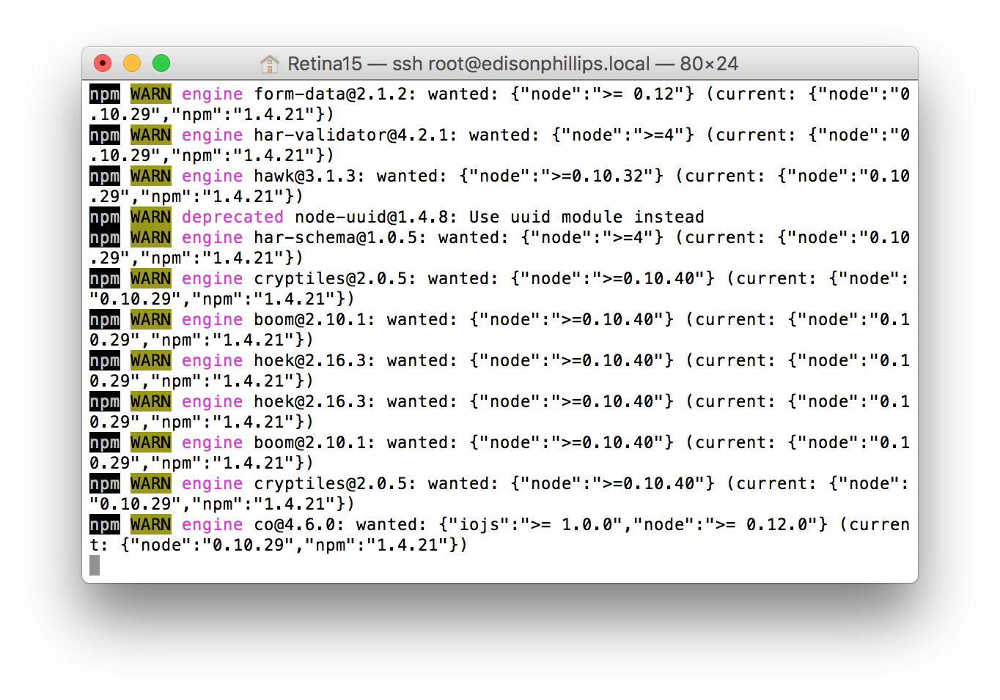
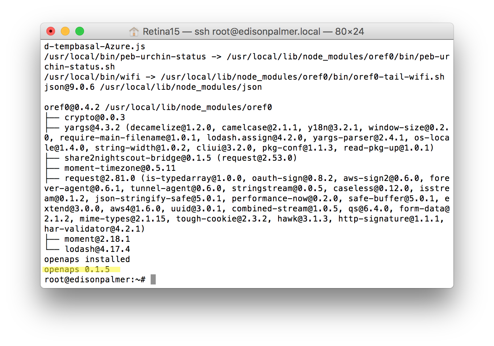
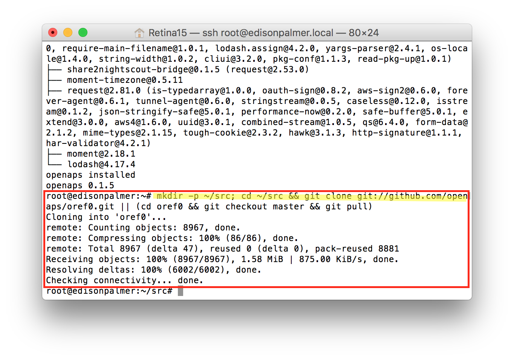
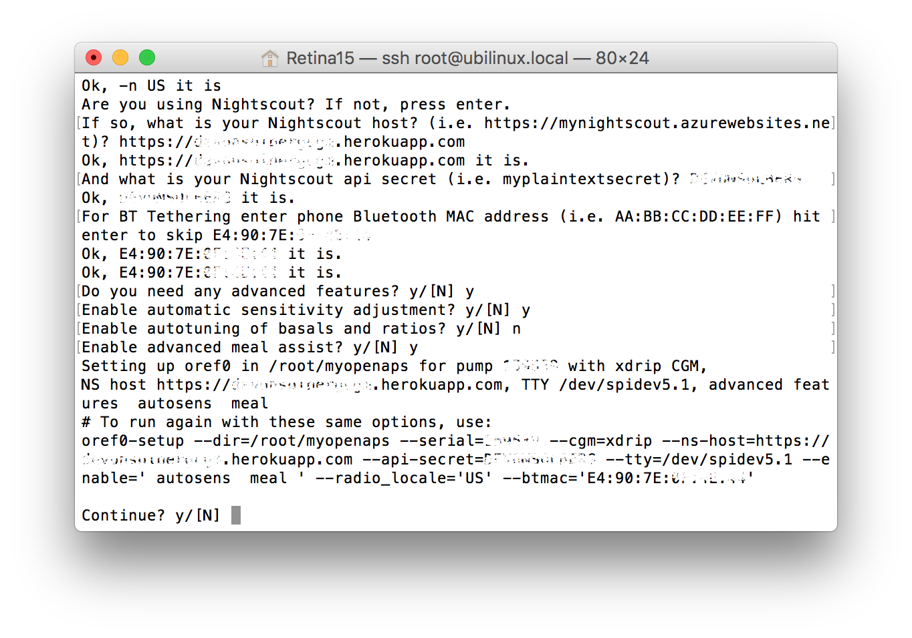
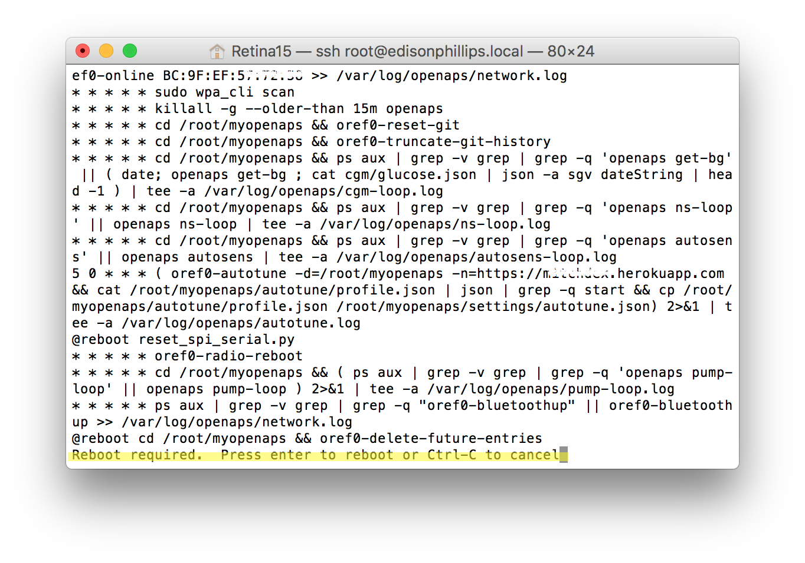

# Phase 2: oref0-setup.sh

We've created an oref0-setup.sh script that can help set up a complete working loop configuration from scratch in just a few minutes. This is in pursuit of our community goal to simplify the technical aspects of setting up a DIY closed loop - while still emphasizing that this is a DIY project that you have personal responsibility for. We also want to encourage you to spend more time and energy exploring whether the algorithm you choose to use is doing what you want it to do and that it aligns with how you might manually choose to take action.

Please make sure to complete ALL steps on this page. **If you skip parts of step 0 and step 1, you will run into issues on step 2. **

## Step 0: Dependencies

You first need to install the base openaps toolkit and its dependencies.

### Automated Installation Script

Running this code will install all of the dependencies for you automatically:
 
`curl -s https://raw.githubusercontent.com/openaps/docs/master/scripts/quick-packages.sh | bash -`

You will see some colorful screens go by such as the screenshot below:

 

If the install was successful, the last line will say something like:
    
    openaps 0.1.5  

The version number above may have been incremented from what is shown here, and that is okay. All you are really looking for is `openaps` followed by a version number.  This lets you know that the install has completed successfully.

If you do not see the screen above, or see error messages, try running it multiple times. It will not hurt to run this multiple times.

(Interested in the development repositories? [See this shell script.](https://raw.githubusercontent.com/openaps/docs/master/scripts/quick-src.sh))

### (If you did the above, skip this and go on to Step 1) Manual Installation

If you prefer to install the dependencies yourself, the following Debian/Ubuntu packages are required:

    git python python-dev python-software-properties python-numpy python-pip nodejs-legacy npm watchdog

The following [npm](https://docs.npmjs.com/) packages are required:

    json oref0

Finally, these [Python pip](https://pip.pypa.io/en/stable/) packages are required:

    openaps openaps-contrib

## Step 1: Pull/clone oref0

Pull/clone the latest oref0 master by running:

`mkdir -p ~/src; cd ~/src && git clone git://github.com/openaps/oref0.git || (cd oref0 && git checkout master && git pull)`

If you have been looping for awhile, are setting up an additional rig, are comfortable using the advanced features from the master branch, and want to test out the latest features of the oref0 dev branch (which may still be highly experimental) you can use:

`mkdir -p ~/src; cd ~/src && git clone -b dev git://github.com/openaps/oref0.git || (cd oref0 && git checkout dev && git pull)`

`cd ~/src/oref0 && npm run global-install`

## Step 2: Run oref0-setup

__Note:__ If you're using the 915MHz Explorer board, you'll need to log in as root to run oref0-setup.sh, as the mraa package doesn't yet support running under an ordinary user account. 

**Be prepared to enter the following items:** 
* directory name for your openaps
* email address for github commits
* serial number of your pump
* whether or not you are using an Explorer board
* if not an Explorer board, and not a Carelink stick, you'll need to enter the mmeowlink port for TI stick or Explorer board (built in TI stick):
    * see [here](https://github.com/oskarpearson/mmeowlink/wiki/Installing-MMeowlink) for directions on finding your port
* (if you're using a Carelink, you will NOT be using mmeowlink)
* how you are getting CGM data.  The options are `g4` (default), `g4-raw`, `g5`, `mdt`, and `xdrip`.  Note:  OpenAPS also attempts to get BG data from your Nightscout.  OpenAPS will always use the most recent BG data regardless of the source.
* Nightscout URL and API secret
* whether you want any of the oref0 advanced features (AMA, Autosens, and/or Autotune)
* BT MAC address of your phone, if you want to pair for BT tethering to personal hotspot
* whether or not you want to automate your loop (using cron)

**Hint:** If you're not sure if you need something (advanced features), you probably don't, but for more information on the advanced features, see [here](http://openaps.readthedocs.io/en/latest/docs/walkthrough/phase-4/advanced-features.html). Also, scheduling something in cron means scheduling the loop to run automatically. So if you want an automated closed loop, Yes, you want to schedule it in cron. If you don't want an automated loop yet, you can always come back and run the `bash ~/myopenaps/oref0-runagain.sh` command later to automate. In addition, running the script again will update the various packages that the script installs.

**Read this note before running the script**: The very first time may take a while (15-20 minutes) for it to successfully read and pull a full history from your pump. Wait at least 20 minutes while watching the log (see below, in step 3 on this page) before asking for help. If it looks like it is giving you an error message, make sure you completed step 0 and 1 (see above!). If in doubt, run step 0 and step 1 again, and run the setup script (step 2) again as well. It will not hurt to run it multiple times, but you will probably want to answer `yes` to the setup script prompt asking if you want to delete any existing crons. Go on to the [next page](http://openaps.readthedocs.io/en/latest/docs/walkthrough/phase-2/troubleshoot-oref0-setup.html) for other ideas of troubleshooting. Read that page's troubleshooting tips before jumping into Gitter with questions about what to try next [and make sure to utilize these tips when asking for help](https://diyps.org/2017/03/19/tips-for-troubleshooting-diy-diabetes-devices-openaps-or-otherwise/).

**Two options for running the oref0-setup script are with or without BT**  Eventually, most users will want to run their rig with BT enabled.  You can run the script with Bluetooth and always come back at a later time to finish the pairing steps in Phase 4.  Until you finish the pairing, your rig will rely on known wifi networks in your wpa-supplicant list that you setup in Phase 0 (or on any offline setups that you have done).

#### oref0-setup.sh script (without Bluetooth tethering - recommended to do for your first setup )

`cd && ~/src/oref0/bin/oref0-setup.sh`

to run the script interactively, or get usage guidelines for providing inputs as command line arguments. 

#### oref0-setup.sh script with Bluetooth

If you want to add Bluetooth tethering to the mix:

`cd && ~/src/oref0/bin/oref0-setup.sh --btmac=AA:BB:CC:DD:EE:FF` (where AA:BB:CC:DD:EE:FF is your phone's BT MAC address) NOTE: Make sure the MAC address is in ALL CAPS.

Please see [Phase 4](https://openaps.readthedocs.io/en/latest/docs/walkthrough/phase-4/bluetooth-tethering-edison.html) for the directions to complete the BT pairing.

**Worldwide pump users**
If you are running from the master branch and not the WW branch, you'll need to follow the instructions at https://github.com/oskarpearson/mmeowlink/wiki/Non-USA-pump-settings to ensure that the correct frequency is used by mmtune.

When you've successfully answered all the input questions from the setup script, it will print a summary of the inputs for you before asking if you want to continue, as shown below:

After the setup script builds your myopenaps, it will ask if you want to schedule a cron (in other words, automate and turn on your loop).  Usually you'll want to answer `yes` and also then press `enter` to reboot after the cron is installed.

### Re-running the oref0-setup.sh script

In the future, you may want to run the setup script again (such as when you want to come back and turn on new, advanced features). To do so, you will be able to run `bash ~/myopenaps/oref0-runagain.sh` to start running the setup script again with those options. (You may first want to `cd ~/myopenaps && cat oref0-runagain.sh` to see what options you have saved in there.  To run it again with different options, you can copy and paste and modify that output, or you can `cd ~/myopenaps && nano oref0-runagain.sh` to change what's saved in the file to run the next time.  Make sure to change `myopenaps` to your openaps directory name if you chose something non-standard when you ran oref0-setup originally.)

If you are running this and the file does not exist, that just means you have not run oref0-setup since updating oref0 to 0.4.0 or later. You will need to run oref0-setup per the above section (with or without Bluetooth); then in the future you can use oref0-runagain.sh.

## Step 3: Watch the logs - REQUIRED!

THIS IS A REQUIRED MUST-LEARN HOW-TO STEP - DO NOT MOVE ON WITHOUT DOING THIS! This is a key skill for monitoring your OpenAPS setup to "check" or "monitor" or "watch" the logs. It's easy:

(For rigs updated to master after 2/7/17 ([here is how to update](http://openaps.readthedocs.io/en/latest/docs/walkthrough/phase-2/update-your-rig.html)), you can simply type the letter "l" (aka the single letter `l`), or use the full tail command below to see the logs).

`tail -F /var/log/openaps/pump-loop.log`

Type control-C to exit the pump-loop log.

This will work anytime, anywhere when you log into your rig and is a necessary stip for troubleshooting in the future. Do not move forward without having done this step. 

Also, there are several loop logs contained within your OpenAPS setup...not just a pump-loop.  For example, there are also logs for the following operations in your rig:

* Autosens adjustments log: `tail -F /var/log/openaps/autosens-loop.log`

* Nightscout log: `tail -F /var/log/openaps/ns-loop.log`

* oref0-online or wifi connection log: `tail -F /var/log/openaps/network.log`

* Autotune log: `tail -F /var/log/openaps/autotune.log`

Please see [Phase 1 Papertrail](http://openaps.readthedocs.io/en/latest/docs/walkthrough/phase-1/papertrail.html) for an easy way to track all your logs in one easy setup.  Papertrail will even allow you to remotely track your logs when you are not logged into your rig.  Setting up Papertrail and watching your logs will dramatically help you understand your rig and help troubleshoot if you run into problems.

