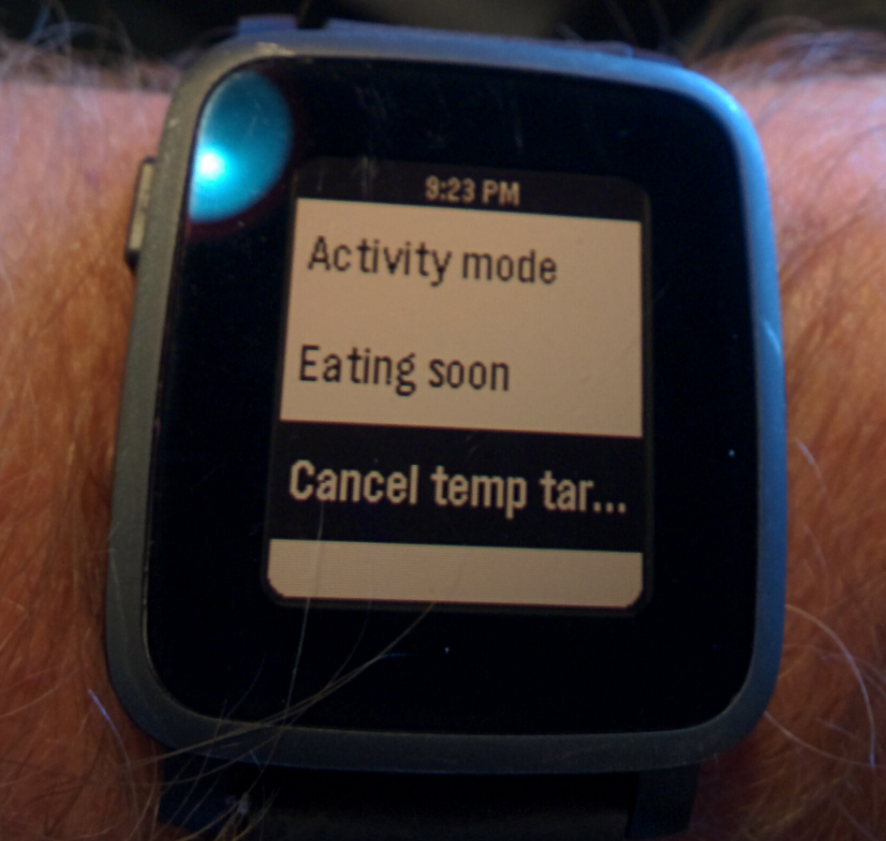
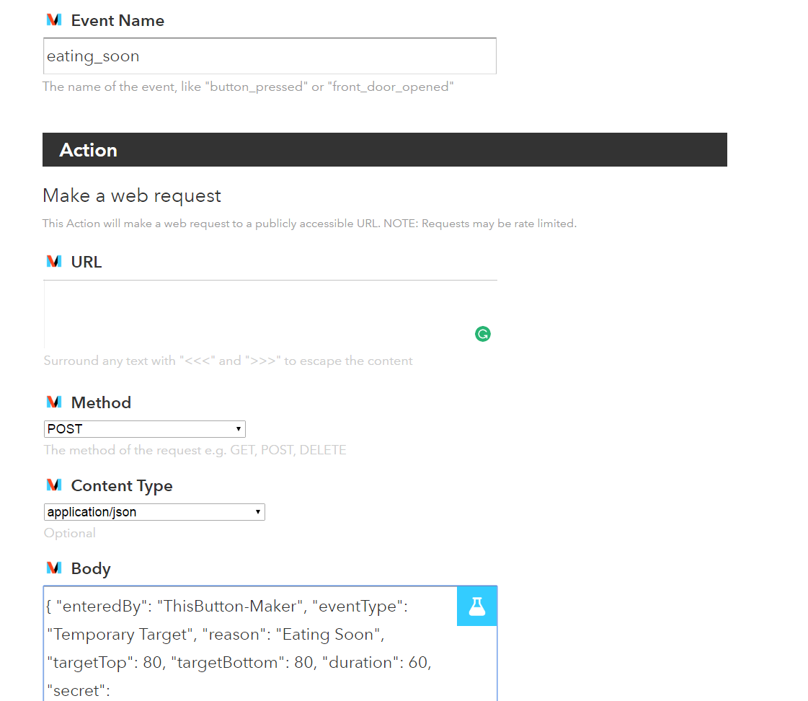
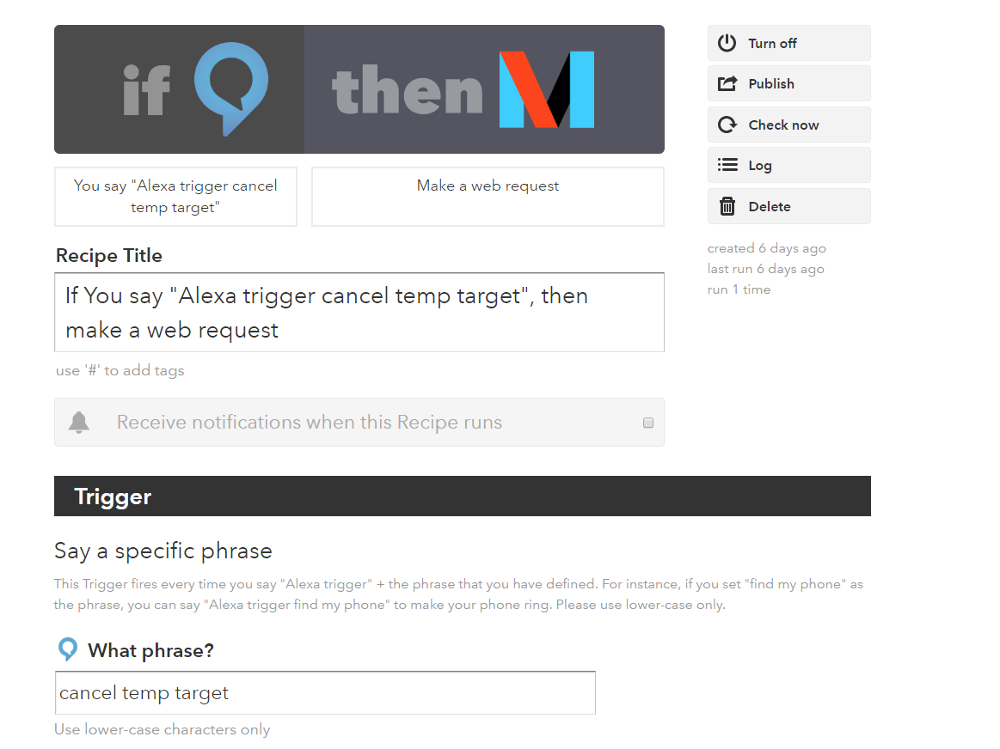

# IFTTT Integration

Want to be able to set or cancel temp targets from your Pebble, Alexa, or anything supports IFTT?  You need an IFTTT.com and Maker account.  Check it the YouTube Video below to see some sample integrations:

<a href="https://www.youtube.com/watch?v=0ck23JTa2Wk&feature=youtu.be" target="_blank"></a>


Cool and handy, right?  I saw my daughter was double arrows down yesterday while I was in the shower and I was able to issue an activity mode temp target (140 for one hour) to help pull her out of a nose dive.

##Prerequisites
* Get an IFTTT.com accout
* Make sure you have a [Maker account](https://ifttt.com/maker)
* Find out what your NS hashed secret key is
  Run the command to find out: `nightscout hash-api-secret <your_secret_key>`
* Get the app ThisButton for your Pebble

##Putting it all together
1. Create a new recipe on IFTTT.com that starts and ends with Maker requests
  * Event Name: eating_soon (Maker requests must be lowercase and use underscores and not spaces)
  * Action:  https://your_url_hereish.azurewebsites.net/api/v1/treatments.json
  * Method: Post
  * Content Type: application/json
  * Body: 
````
  {"enteredBy": "ThisButton-Maker", "eventType": "Temporary Target", "reason": "Eating Soon", "targetTop": 80, "targetBottom": 80, "duration": 60, "secret": "a_totally_hashed_password_goes_here!!!"}
 ````


2. Understanding the JSON in the Body:
  * enteredBy: Will show up on the NS website this way - enter what you want
  * eventType: defines what we are doing - leave as is
  * reason: will show up on the NS website - enter what you want
  * targets: specify the range you want - enter what you want
  * duration: you can make them as long or as short as you want - enter what you want
  * secret: your hashed API secret key

3. Test your Maker request by going here:
  * [https://ifttt.com/maker](https://ifttt.com/maker)
  * Click the "How to Trigger Events" link
  * Copy the link under: "Make a POST or GET web request to:"
  * Replace the {event} with one of the event like: eating_soon
  * Should look like: https://maker.ifttt.com/trigger/eating_soon/with/key/{of_course_this_is_the_actual_maker_key_here_xalsdjflaksjdflakjsdf}
  * Drop that link into a browser and check your NS website to see if it worked.
    * Mine shows in about 5 seconds
    * Some folks have a bug where they need to refresh the browser.  Wait at least 30 seconds before trying this, though.

4. Create more events / requests!
  * activity_mode would be 140 for an hour...or whatever you want.  
  * You definitely want to create a cancel_temp_target as well.  It would look like this: 
````
{"enteredBy": "Alexa-Maker", "eventType": "Temporary Target", "duration": 0, "secret": "a_totally_hashed_password_goes_here!!!"}
````

4. Hook it up with ThisButton for the Pebble Watch - pictured at the very top of this page
  * You need to enter / get your Maker API key in the Settings for ThisButton on your phone when you go into the Pebble App
  * Under Events, there are two fields
     * Name: what shows up on your watch
     * Event: the name of the Maker event to fire.  It will have underscores in it like: eating_soon . 
 * Enter all the different events you created here and Submit them.
 * Fire up the ThisButton app on your Pebble and try setting a new temp target.
 * You can also add the ThisButton app as a short cut on your Pebble. If you don’t have shortcuts already, press and hold either the up, down, or middle button and follow the prompts. If you have both shortcuts programmed and want to change one, go to menu > settings> quick launch and follow prompts. 

5. You can hook it up and use it with the DoButton app that support IFTTT calls...it has been tested and works using the information in 1 above .  You might need to email yourself the JSON so you can copy and paste it easily.  I permanently deleted this email aafterwards since it has my secret key in it.

6. Since you have IFTTT / Maker requests working, you can get it to work with anything that supports IFTTT, including Alexa.
  
  * Alexa requests do not need underscores, FYI.
  

#Big thanks
To Rachel Sandlain / Jason Calabrese for coming up with this method and sharing it!
