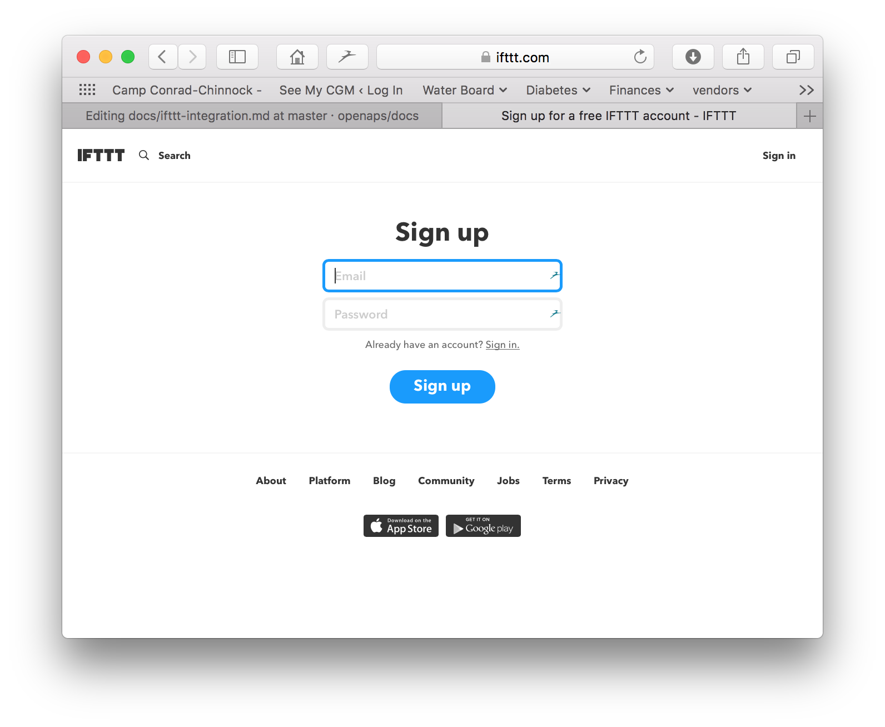
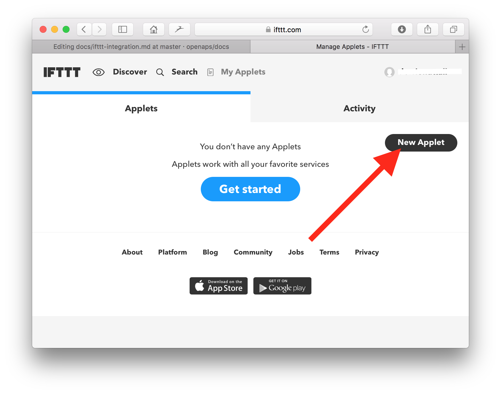
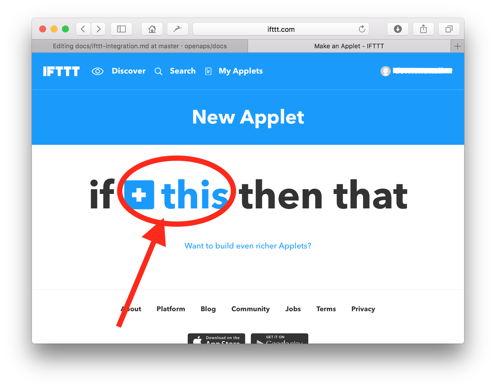
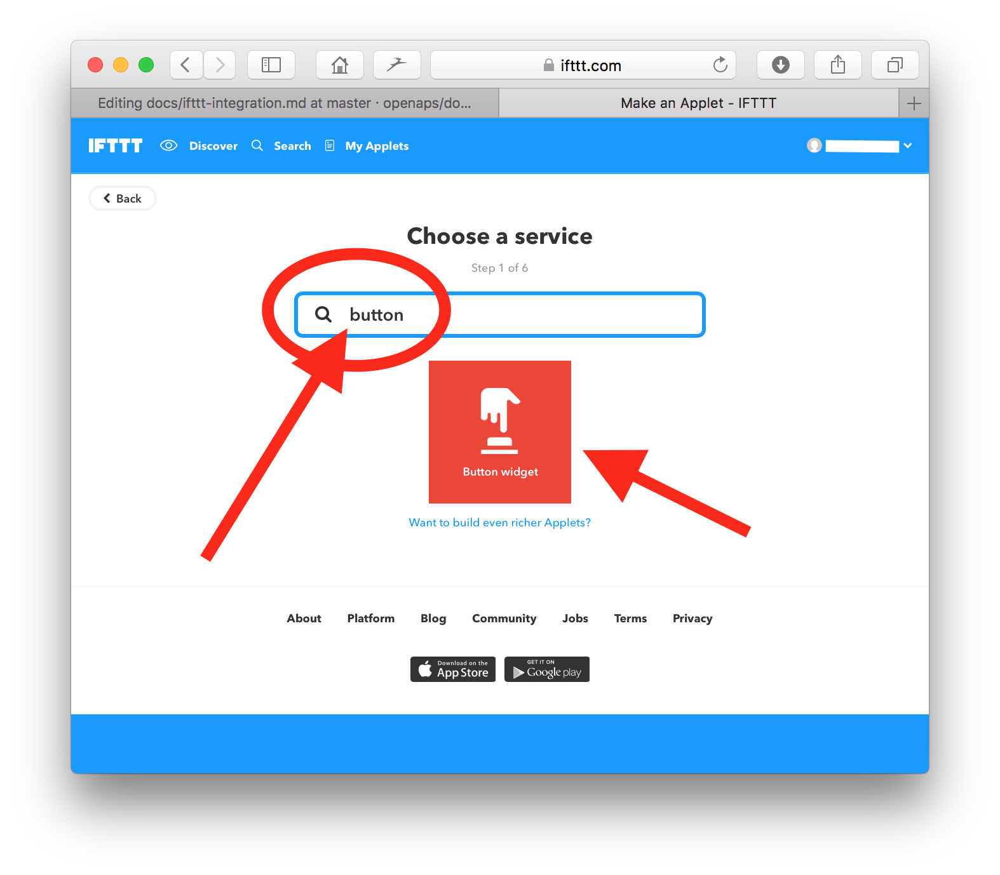
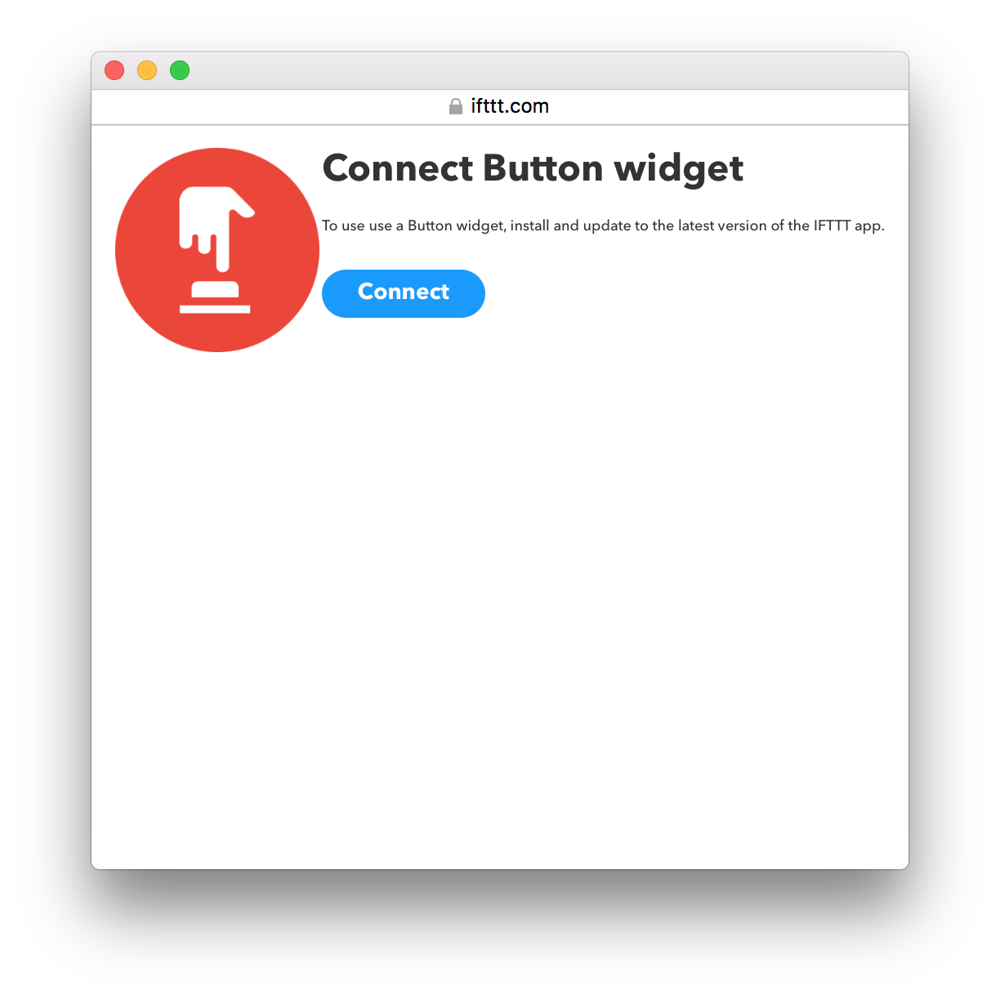
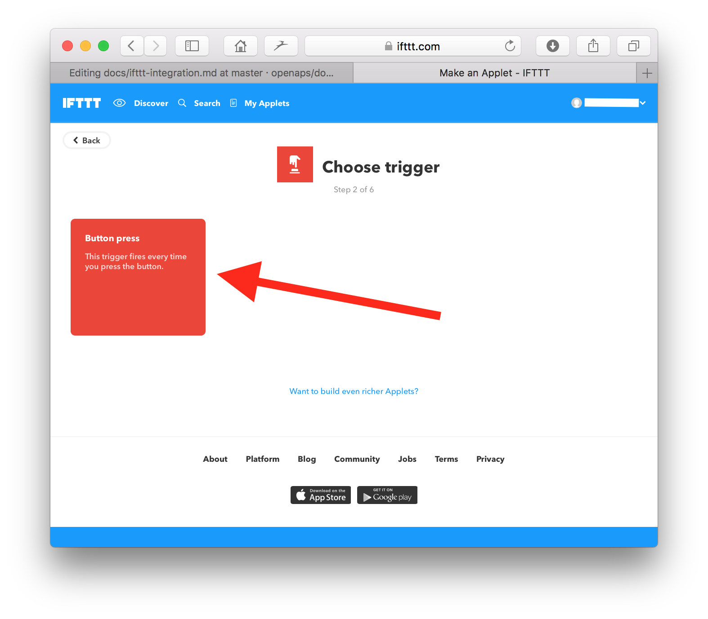
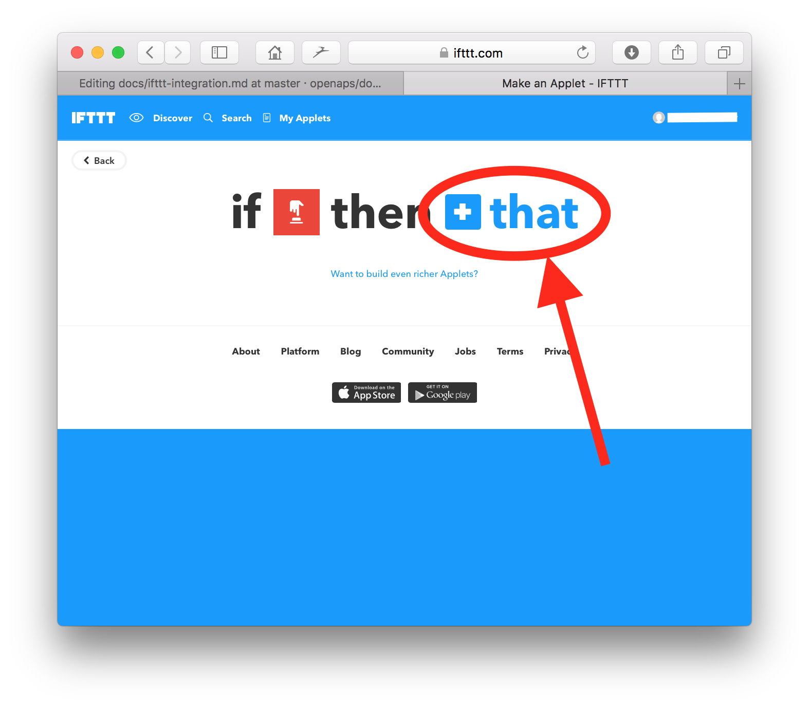
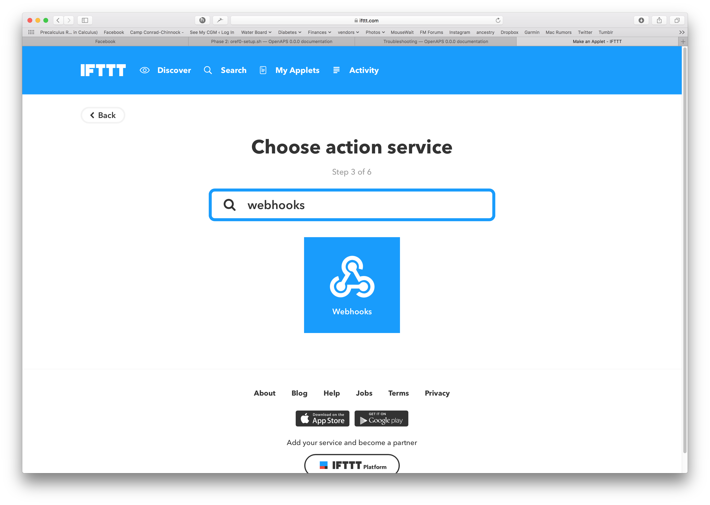
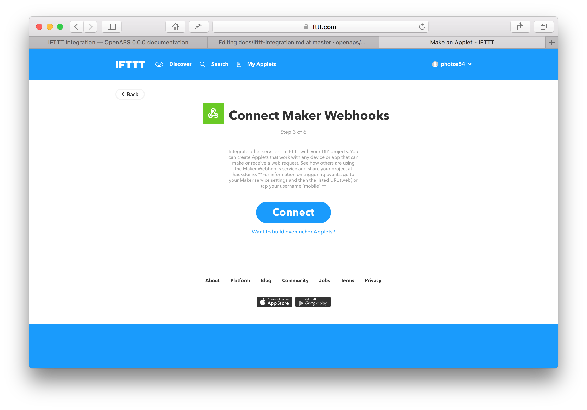
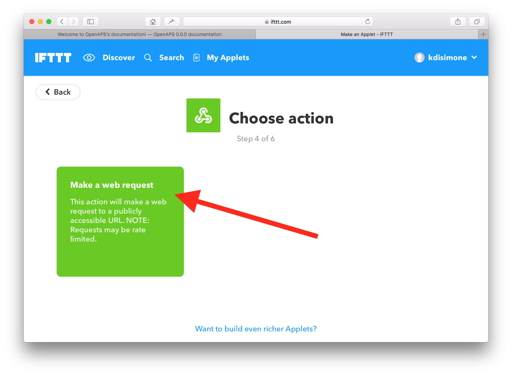

# IFTTT Integration

Want to be able to set or cancel temp targets from your phone, Pebble, Alexa, or anything supports IFTT?  You need an IFTTT.com account.  Check out the YouTube Video below to see some sample integrations:

<a href="https://youtu.be/0ck23JTa2Wk" target="_blank"></a>


## Prerequisites

* First we need to gather one thing called your "hashed API Secret".  This is basically your Nightscout site's API secret, but scrambled into a confusing long string.  Find out what your NS hashed secret key is by running the command to find out: `nightscout hash-api-secret <your_secret_key>` while logged into your rig 
---OR----
* In your internet browser, open a console window while viewing your Nightscout site, hit refresh, and your hashed secret key will be shown as "apisecrethash: "xxxxxxxxxx...""  For Safari users on Mac, you can see a console window by selecting Develop from the Safari top menu, and then Show Page Source.  Your hashed API secret can be copied and pasted, as shown below


* Get an [IFTTT account](https://ifttt.com/join) 



## Putting it all together

* Login to your IFTTT.com account and select the "New Applet" button.



* In the screen that appears, click on the blue "+this" part of the screen



* In the next screen, type "button" in the search field and then click on the red box labelled "ButtonWidget"



* Connect the buttonwidget by clicking on the large red "connect" button



* Click on the large red "button press" box 



* Click on the blue "+that" text



* Enter "maker" in the search field and click on the Maker app



* Connect the Maker app



* Select the grey "Make a Web Request" box



*  Now you will have a blank web request template to complete.  The following info should be filled in:

URL: https://yoursite.herokuapp.com/api/v1/treatments.json
Method: POST
Content Type: application/json

Body:  The content of the body will depend on the action that you would like this particular button press to perform.  Some sample content:

Eating soon
```
  {"enteredBy": "IFTTT", "eventType": "Temporary Target", "reason": "Eating Soon", "targetTop": 80, "targetBottom": 80, "duration": 60, "secret": "your_hashed_api_goes_here!!!"}
```
Activity
```
  {"enteredBy": "IFTTT", "eventType": "Temporary Target", "reason": "Activity", "targetTop": 140, "targetBottom": 120, "duration": 120, "secret": "your_hashed_api_goes_here!!!"}
```
Cancel Temp Target
```
{"enteredBy": "IFTTT", "eventType": "Temporary Target", "duration": 0, "secret": "your_hashed_api_goes_here!!!"}
```
Low Treatment
```
{"enteredBy": "IFTTT", "reason": "low treatment", "carbs": 15, "secret": "your_hashed_api_goes_here!!!"}
```

## Understanding the JSON in the Body:

* enteredBy: Will show up on the NS website this way - enter what you want
* eventType: defines what we are doing - leave as is
* reason: will show up on the NS website - enter what you want
* targets: specify the range you want - enter what you want
* duration: you can make them as long or as short as you want - enter what you want
* secret: your hashed API secret key

* Click the "Create Action" button on the bottom of the screen when you finish.  You can repeat the process above to create new applets for as many IFTTT actions as you'd like to create.


## Test your Maker request by going here:

* [https://ifttt.com/maker](https://ifttt.com/maker)
* Go to the settings and copy-paste the url into a new window
* Replace the {event} with one of the event like: eating_soon
* Should look like: https://maker.ifttt.com/trigger/eating_soon/with/key/{of_course_this_is_the_actual_maker_key_here_xalsdjflaksjdflakjsdf}
* Select "Test it"
  * Mine shows in about 5 seconds
  * Some folks have a bug where they need to refresh the browser.  Wait at least 30 seconds before trying this, though.

## Hook it up with ThisButton for the Pebble Watch - pictured at the very top of this page

* You need to enter / get your Maker API key in the Settings for ThisButton on your phone when you go into the Pebble App
   * Your API can be found at the top of your MAKER settings (Note: There is a settings page for IFTTT and for Maker, you must be on the maker page to access Maker settings)
   * For some _absurd_ reason, the API is shown in a sans-serif font, so it's best to copy and paste the key into a document and change to a serif font (like Times New Roman) - Otherwise you can't tell the difference between an upper case i and a lower case L.
* Under Events, there are two fields
   * Name: what shows up on your watch
   * Event: the name of the Maker event to fire.  It will have underscores in it like: `eating_soon`.
* Enter all the different events you created here and Submit them.
* Fire up the ThisButton app on your Pebble and try setting a new temp target.
* You can also add the ThisButton app as a short cut on your Pebble. If you don’t have shortcuts already, press and hold either the up, down, or middle button and follow the prompts. If you have both shortcuts programmed and want to change one, go to menu > settings> quick launch and follow prompts.

## Using the DoButton

* You can hook it up and use it with the DoButton app that supports IFTTT calls...it has been tested and works using the information in 1 above.  You might need to email yourself the JSON so you can copy and paste it easily.  I permanently deleted this email afterwards since it has my secret key in it.

* Since you have IFTTT / Maker requests working, you can get it to work with anything that supports IFTTT, including Alexa.
  
  * Alexa requests do not need underscores, FYI.

## Add to the "Today" widget on your iPhone

 


* Make sure you have the IFTTT app on your phone and that you are logged in.
* Go into the "Today" (downswipe from top of phone) and scroll to the bottom - you should see 1 new widget available; otherwise click "edit". This should show a list of available widgets to add to your screen. Select IFTTT.
* It should pull in any existing applets from your IFTTT account that are set to be run by "DoButton". This means if you only added applets/recipes to work with ThisButton on Pebble, you'll need to set additional recipes up. Do similar to the above steps to add new applets; the only difference is to start with If (DoButton) Then (Maker event), aka select "DoButton" for the first tool integration, rather than Maker in both places. 
* All of the same steps apply for the Maker information for the "Then that" part - insert your URL, select POST, Content Type: application/json, etc. You'll probably want to copy and paste from your other applets, but make sure to edit the text to show that these will be entered by "DoButton" rather than "ThisButton_Maker" or similar.
* Once you've saved, these applets should show up in your Today widget for IFTTT!
