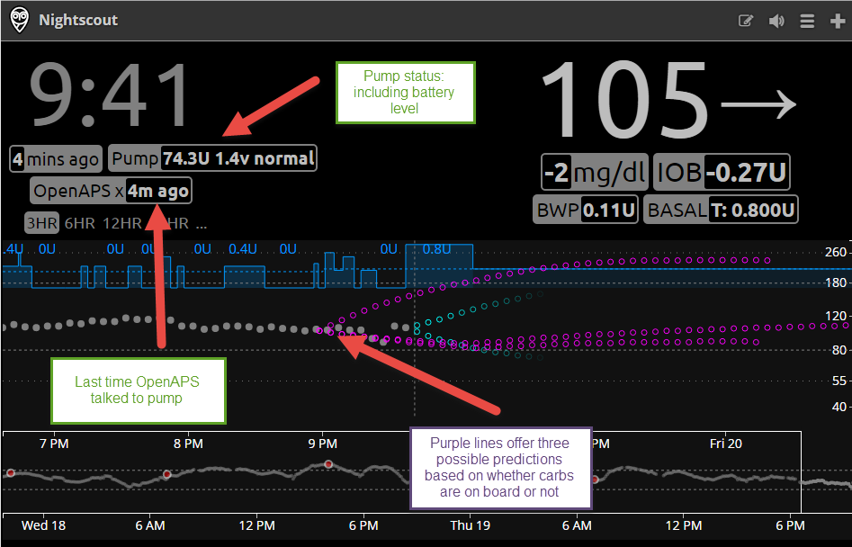
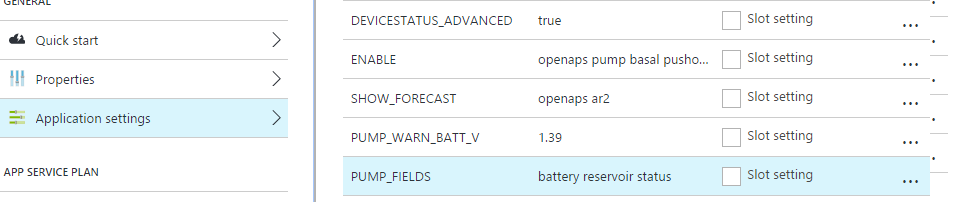
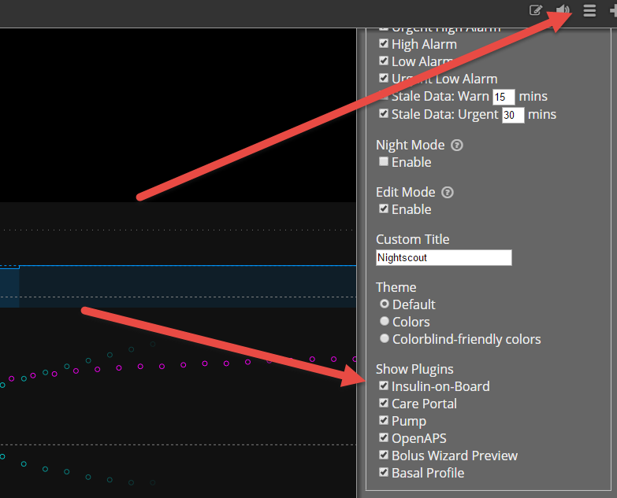
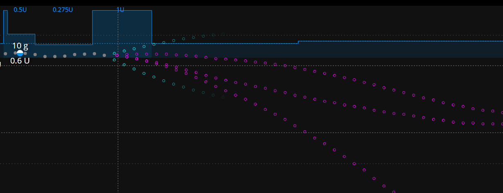

## Configuring Automatic Sensitivity and Advanced Meal Assist Mode

For more information review https://github.com/openaps/oref0/issues/58

Automatic Sensitivity automatically detects when the PWD is more or less sensitive to insulin than normal and then is used as an input to the algorythm that makes adjustments to temp basals.

Advanced Meal Assist, aka AMA, will do predictions as to where BG is going and will start issuing temp basal much sooner than normal after a meal.  By default, AMA is turned off and you need to add some items to your reports to get it working.  With AMA enabled, bolus snooze has been shorted to DIA/3 or DIA/4 as opposed to a normal Bolus Snooze of DIA/2.

Also, if you have Meal Assist enabled already (the reports), it should just be a matter of pulling the correct oref0 branch to start benefiting from AMA.

1)	Ensure you get the latest AMA branch of oref0 tools
```
cd
cd src
cd oref0
git pull
git checkout advanced-meal-assist
npm install && sudo npm install -g && sudo npm link && sudo npm link oref0
```
OR
```
sudo npm install -g git://github.com/openaps/oref0.git'#advanced-meal-assist'
```

Make sure you run the last line to install the tools.

It probably isn't necessary but to make sure all libraries load cleanly issue a restart:
```
sudo reboot
```


2)	Next in order to properly execute the new auto-sensitivity module, you need to have at least 24 hour worth of pump history data and enough bg readings (past 24 hours).
In your openaps.ini apply the following changes:
`nano openaps.ini` cut and paste:
```
[report "monitor/glucose.json"]
device = cgm
hours = 25.0
use = iter_glucose_hours
reporter = JSON


[report "monitor/clock.json"]
device = pump
use = read_clock
reporter = JSON

[report "monitor/clock-zoned.json"]
use = clock
reporter = JSON
astimezone = False
date = None
adjust = missing
input = monitor/clock.json
device = tz
timezone = PDT


[report "monitor/pumphistory.json"]
device = pump
hours = 5.0
use = iter_pump_hours
reporter = JSON

[report "monitor/pumphistory-zoned.json"]
use = rezone
reporter = JSON
astimezone = False
date = timestamp dateString start_at end_at created_at
adjust = missing
input = monitor/pumphistory.json
device = tz
timezone = PDT


[report "settings/pumphistory-24h.json"]
device = pump
hours = 27.0
use = iter_pump_hours
reporter = JSON


[report "settings/pumphistory-24h-zoned.json"]
use = rezone
reporter = JSON
astimezone = False
date = timestamp dateString start_at end_at created_at
adjust = missing
input = settings/pumphistory-24h.json
device = tz
timezone = PDT


[report "monitor/meal.json"]
profile = settings/profile.json
use = shell
clock = monitor/clock-zoned.json
reporter = text
json_default = True
carbs = monitor/carbhistory.json
pumphistory = monitor/pumphistory-zoned.json
basal = settings/basal_profile.json
device = meal
remainder = 
glucose = monitor/glucose.json

[report "settings/autosens.json"]
profile = settings/profile.json
use = shell
reporter = text
basal_profile = settings/basal_profile.json
json_default = True
pumphistory = settings/pumphistory-24h-zoned.json
device = detect-sensitivity
remainder = 
isf = settings/insulin_sensitivities.json
glucose = monitor/glucose.json


[report "enact/suggested.json"]
profile = settings/profile.json
use = shell
temp_basal = monitor/temp_basal.json
reporter = text
json_default = True
iob = monitor/iob.json
autosens = settings/autosens.json
device = determine-basal
remainder = 
meal = monitor/meal.json
glucose = monitor/glucose.json


[device "detect-sensitivity"]
vendor = openaps.vendors.process
extra = detect-sensitivity.ini

[device "determine-basal"]
vendor = openaps.vendors.process
extra = determine-basal.ini

[device "meal"]
vendor = openaps.vendors.process
extra = meal.ini


```

Note: If using Nightscout add count=288 to your entries.json API call as a querystring parameter

One way to do this is to go to your openaps directory and do:

`nano ns-glucose.ini`
this opens the file in the Nano editor which allows you to make these changes:
For NS it will look something like this depending on how you implement it (note the ?count=288)  that is what you have to add

```
[device "ns-glucose"]
fields = 
cmd = bash -c "curl -m 30 -s $NIGHTSCOUT_HOST/api/v1/entries/sgv.json?count=288 | json -e \"this.glucose = this.sgv\""
args = 
```

If your [glucose.json] does not have enough entries you will see a warning when running your autosens.json report "Error: not enough glucose data to calculate autosens."


Let's setup the inputs needed to detect insulin sensitivity: `nano detect-sensitivity.ini`
And paste this in:
```
[device "detect-sensitivity"]
fields = glucose pumphistory isf basal_profile profile
cmd = oref0
args = detect-sensitivity
```

Let's update determine basal to use AMA and auto-sens; `nano determine-basal.ini`:
And paste this in:
```
[device "determine-basal"]
fields = iob temp_basal glucose profile autosens meal
cmd = oref0
args = determine-basal

```


And let's set up meal.ini `nano meal.ini`:
And paste this in:
```
[device "meal"]
fields = pumphistory profile clock carbs glucose basal
cmd = oref0
args = meal

```

3) We need to update our aliases to actually call these new reports.

`nano openaps.ini`

**Scott / Dana: Can I throw Autosens at the end of this?** 

And update your monitor-pump alias to this:

```
monitor-pump = report invoke monitor/clock.json monitor/temp_basal.json monitor/pumphistory.json monitor/pumphistory-zoned.json monitor/clock-zoned.json monitor/iob.json monitor/meal.json monitor/reservoir.json monitor/battery.json monitor/status.json settings/autosens.json
```

4) **You should have AMA set up now!  Passing the meal data into determine-basal ENABLES AMA. **  

But wait, we want to visualize this NS, don't we?  We need a couple of more reports / aliases to set up:

Reports regarding pump status:
```
[report "monitor/reservoir.json"]
device = pump
use = reservoir
reporter = JSON

[report "monitor/battery.json"]
device = pump
use = read_battery_status
reporter = JSON

[report "monitor/status.json"]
device = pump
use = status
reporter = JSON
```

More aliases to apply to openaps.ini:
```
prep-pumphistory-entries = ! bash -c "cat monitor/pumphistory-zoned.json | json -e \"this.dateString = this.timestamp\" | json -e \"this.medtronic = this._type\" | json -e \"this.type = \\\"medtronic\\\"\" | json -e \"this.date = new Date(Date.parse(this.timestamp)).getTime( )\" > upload/pumphistory-entries.json"
upload-pumphistory-entries = ! bash -c "openaps prep-pumphistory-entries && ns-upload-entries upload/pumphistory-entries.json"
latest-ns-treatment-time = ! bash -c "nightscout latest-openaps-treatment $NIGHTSCOUT_HOST | json created_at"
format-latest-nightscout-treatments = ! bash -c "nightscout cull-latest-openaps-treatments monitor/pumphistory-zoned.json settings/model.json $(openaps latest-ns-treatment-time) > upload/latest-treatments.json"
upload-recent-treatments = ! bash -c "openaps format-latest-nightscout-treatments && test $(json -f upload/latest-treatments.json -a created_at eventType | wc -l ) -gt 0 && (ns-upload $NIGHTSCOUT_HOST $API_SECRET treatments.json upload/latest-treatments.json ) || echo \"No recent treatments to upload\""
format-ns-status = ! bash -c "ns-status monitor/clock-zoned.json monitor/iob.json enact/suggested.json enact/enacted.json monitor/battery.json monitor/reservoir.json monitor/status.json > upload/ns-status.json"
upload-ns-status = ! bash -c "grep -q iob monitor/iob.json && grep -q absolute enact/suggested.json && openaps format-ns-status && grep -q iob upload/ns-status.json && ns-upload $NIGHTSCOUT_HOST $API_SECRET devicestatus.json upload/ns-status.json"
upload = ! bash -c "echo -n Upload && ( openaps upload-ns-status; openaps report invoke enact/suggested.json 2>/dev/null; openaps pebble; openaps upload-pumphistory-entries; openaps upload-recent-treatments ) 2>/dev/null >/dev/null && echo ed"
```


5) Now if you loop (making sure you are calling your updated aliases and reports, you should have AMA influencing temp basal determinations and have everything upload into NS.  Now, we need to visualize this data in NS so your NS can look like this:



6) Upgrade / create a new NS install that is .9 beta 2 (Gluten Free Grilled Cheese)  at the lowest.  Grilled Cheese will allow you to visualize your possible BGs based on the carbs you have onboard plus some other cool stuff like battery level alerts, true IOB, etc.  Do it.  Do it now!

7) Once you have your new NS up and running you need to enable some new app settings:
```
ENABLE="openaps pump basal pushover maker careportal iob bwp raw"
SHOW_FORECAST="openaps ar2"
DEVICESTATUS_ADVANCED=true
PUMP_WARN_BATT_V=1.39
PUMP_FIELDS="battery reservoir status"

```
In Azure, it looks like this:


8) Once you have added these elements, stop and start your NS website so they will take affect.

9) Lastly, go and display these plugins that you have just enabled:


10) Pop the champagne!  You have done it!!!

## Breaking Down Autosens

When you watch your loop run and Autosens is going to be detected, you might see something like this:

```
-+>>>>>>>>>>>>+++->->+++>++>>+>>>>>>>>++-+>>>>>>>-+++-+--+>>>>>>>>>>>>>>>>>>>>>>>>>++-++++++--++>>>++>>++-++->++-+++++++>+>>>>>>>>>>>>>>>>>++-+-+-+--++-+--+++>>>>>>++---++----+---++-+++++>>>++------>>>++---->>+++++--+++-++++++++--+--+------++++++++++>>>>++--+->>>>>>>>>>++++-+-+---++++ 34% of non-meal deviations negative (target 45%-50%)
Excess insulin resistance detected: ISF adjusted from 100 to 73.52941176470588
```

Here's what each symbol above means:

\> : deviation from BGI was high enough that we assume carbs were being absorbed, and disregard it for autosens purposes 

\+ : deviation was above what was expected

\- : deviation was below what was expected

= : BGI is doing what we expect

**Scott / Dana: can folks use this data to make adjustments if their basals are proper?  Recommendations here? **

## Breaking Down Those Purple Predictive Lines - ** Scott / Dana: Are these called anything?**


Top line == based on current carb absorption and most accurate right after eating carbs

Middle line == assumes 10 mg/dL/5m carb absorption and most accure the rest of the time

Bottom line == based on insulin only

If no carbs are onboard, then you will have only ONE line.


